# ⚡ EV-GRAMA CHARGE

<div align="center">

### Community-Based Smart Electric Vehicle Charging Ecosystem

Native Android Application | Kotlin | Android Studio | Major Internship Project

</div>

---

## Project Overview

EV-GRAMA CHARGE is a native Android-based smart electric vehicle charging platform developed to address accessibility challenges in EV charging infrastructure through a community-driven approach. The application creates a shared charging ecosystem where EV travellers can discover nearby charging hosts, request charging access, and manage charging sessions efficiently.

The system is designed to bridge the gap between EV users and locally available charging resources by enabling individuals to share charging points within their community. The platform focuses on usability, accessibility, and scalable system design while providing an organized workflow for both travellers and charging hosts.

This project has been developed as a major internship project with emphasis on software architecture, modular implementation, structured navigation, maintainability, and real-world applicability.

---

## Problem Statement

Limited charging infrastructure and uneven availability of charging stations continue to be major barriers to electric vehicle adoption. EV-GRAMA CHARGE addresses this challenge by introducing a decentralized charging-sharing model where users can locate nearby charging hosts and access charging facilities based on availability and booking requests.

The platform aims to improve charging accessibility while promoting efficient utilization of existing charging resources.

---

## Objectives

- Provide a community-driven EV charging ecosystem
- Enable discovery of nearby charging hosts
- Facilitate charging slot requests and booking management
- Support role-based workflows for Travellers and Hosts
- Improve charging accessibility through local resource sharing
- Provide scalable architecture for future enhancements

---

## Core Features

### Authentication & User Access
- Mobile login workflow
- Role-based user onboarding
- Traveller and Host profile management
- Session handling and navigation flow

### Traveller Module
- Browse nearby charging hosts
- View charging host details
- Request charging sessions
- Track booking and charging status
- Charging range and charging-time estimation

### Host Module
- Host dashboard for managing requests
- Availability management system
- Booking approval workflow
- Profile and charging details management

### Booking & Session Workflow
- Booking request generation
- Request acceptance and status updates
- Session monitoring flow
- Post-session review mechanism

### Rating & Review System
- User feedback collection
- Review submission
- Rating management system

---

## Technical Implementation

The application is developed as a native Android project using Kotlin and follows structured Android development practices. The implementation emphasizes modularity, maintainability, and separation of responsibilities.

The project adopts a layered design approach that separates business logic, presentation logic, and data handling components for improved scalability and easier future expansion.

The application structure includes:

- Domain models
- Navigation components
- Screen-based UI modules
- Theme and design components
- Booking and session models
- User and host management modules

---

## Architecture

The system is designed using a layered architecture structure:

```text
Presentation Layer
        ↓
Business Logic Layer
        ↓
Domain Layer
        ↓
Data Layer
```

This architecture ensures:

- Separation of concerns
- Better code maintainability
- Reusability of components
- Scalable implementation
- Modular development workflow

---

# Application Screens & Workflow

The following screenshots demonstrate the complete application workflow and key user interactions.

Create a folder:

```text
screenshots/
```

Store images as:

```text
1.png
2.png
3.png
...
12.png
```

---

## 1. Application Launch Screen

Application launcher and system entry point for EV-GRAMA CHARGE.

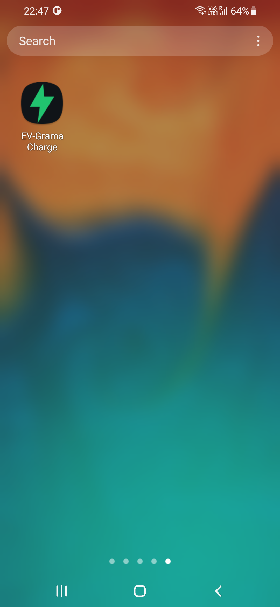

---

## 2. User Registration Interface

Initial onboarding screen allowing users to enter profile details and choose a role.

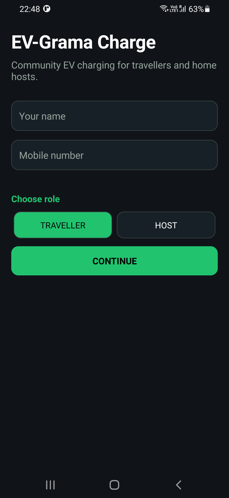

---

## 3. Traveller Registration Workflow

Traveller profile initialization and mobile registration flow.

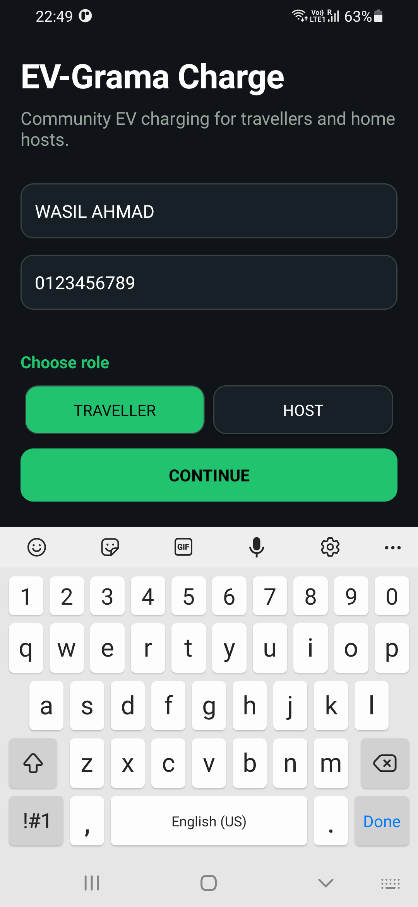

---

## 4. Host Registration Workflow

Host onboarding process for users offering charging services.

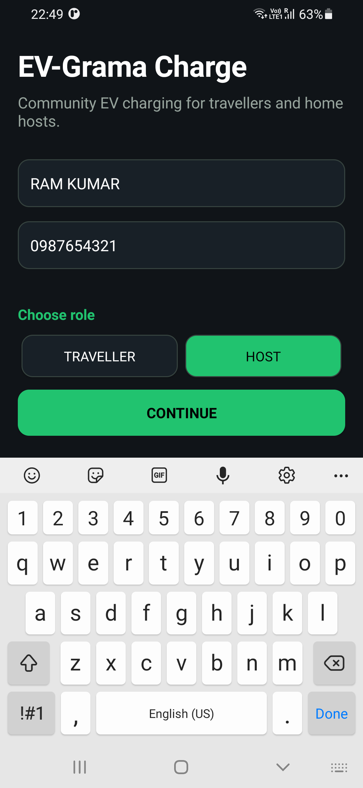

---

## 5. Host Dashboard

Dashboard for charging hosts to manage charging availability, pricing, requests, and profiles.

Features:

- Availability management
- Charging configuration
- Request handling
- Schedule management

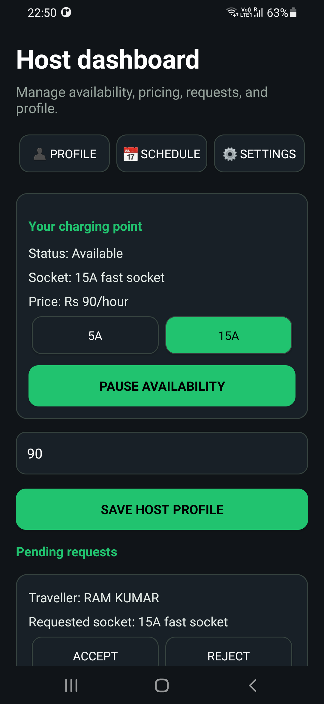

---

## 6. Nearby Charging Discovery

Displays nearby charging hosts and available charging stations.

Features:

- Distance information
- Pricing
- Socket details
- Request generation
- Google Maps support

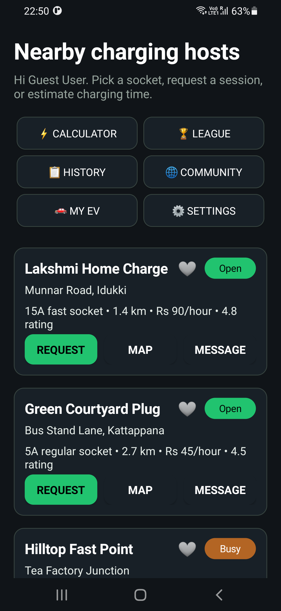

---

## 7. Booking Request Management

Handles booking workflow and charging session requests.

Features:

- Booking generation
- Host approval
- Cost estimation
- Session tracking

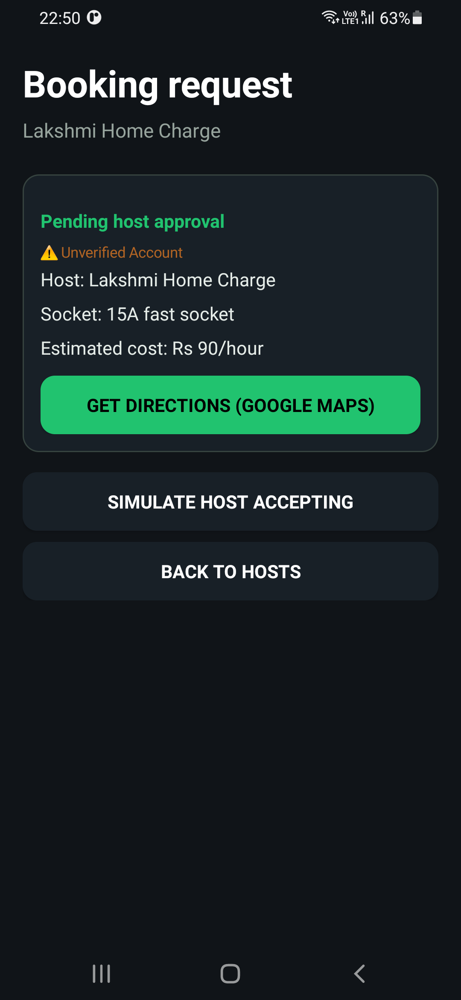

---

## 8. Charging Calculator

Charging estimation utility for battery and range prediction.

Features:

- Battery input
- Charging estimation
- Distance prediction
- Energy calculation

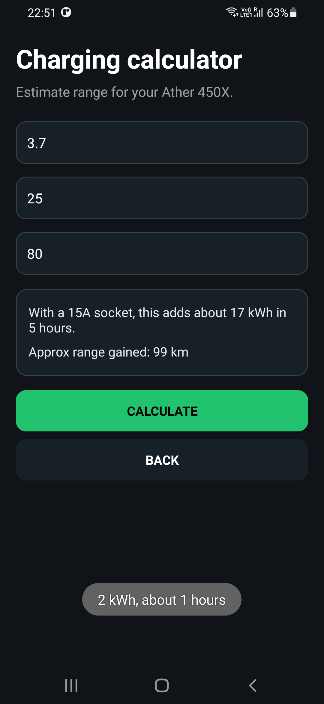

---

## 9. Green League

Gamification feature for eco-friendly user engagement.

Features:

- Leaderboards
- Rankings
- Sustainability rewards

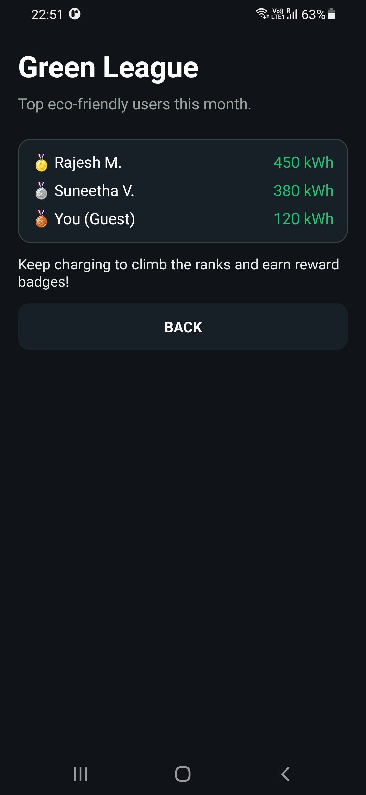

---

## 10. Community Feed

Provides EV-related updates and local charging announcements.

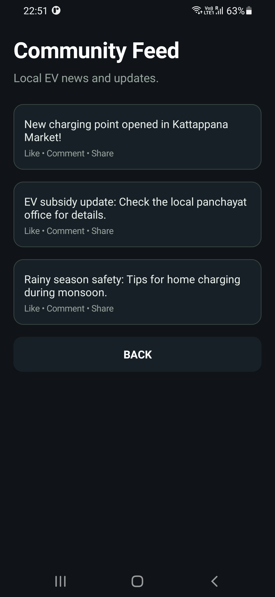

---

## 11. EV Profile Management

Stores EV specifications for personalized charging calculations.

Features:

- Vehicle details
- Battery information
- Charging profile setup

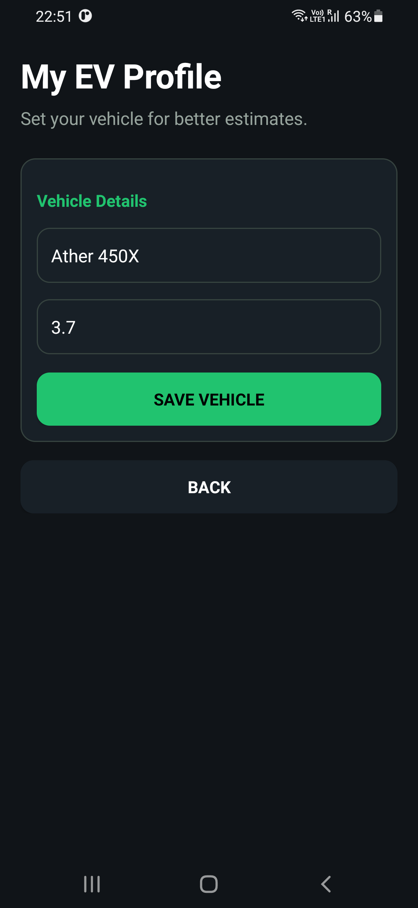

---

## 12. Application Settings

User customization and application configuration module.

Features:

- Language settings
- Session management
- Account controls

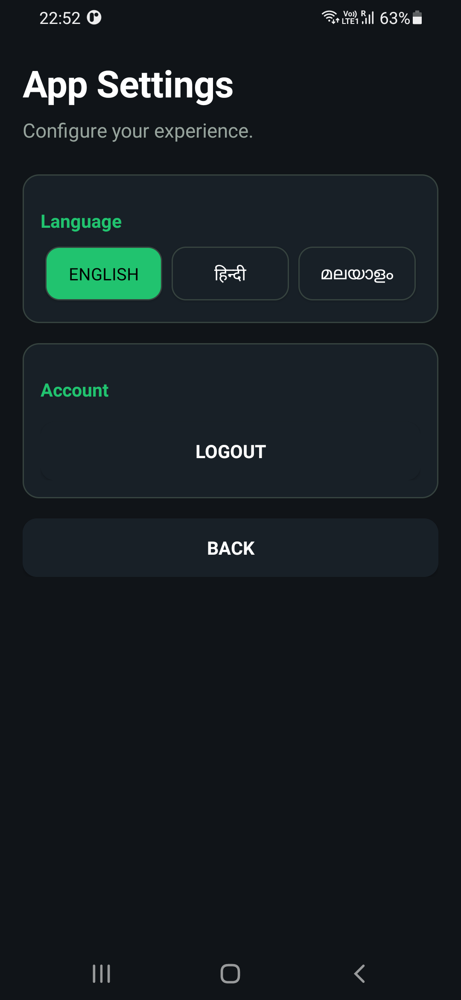

---

## Technology Stack

| Component | Technology |
|------------|-------------|
| Language | Kotlin |
| IDE | Android Studio |
| Architecture | Layered Architecture |
| UI Design | Material Design |
| Build Tool | Gradle |
| Version Control | Git & GitHub |

---

## Project Structure

```text
app/
├── domain/
├── navigation/
├── ui/
│   ├── screens/
│   └── theme/
├── resources/
├── models/
└── utilities/
```

---

## Build & Execution

Clone repository:

```bash
git clone <repository-url>
```

Move into project:

```bash
cd EV-GRAMA-CHARGE
```

Build:

```bash
./gradlew :app:assembleDebug
```

Run through Android Studio using the `app` configuration.

---

## Future Enhancements

- Firebase integration
- Real-time synchronization
- Payment gateway integration
- Google Maps live tracking
- AI-based charging recommendations
- Advanced analytics dashboard
- MVVM architecture implementation

---

## Conclusion

EV-GRAMA CHARGE demonstrates a scalable and community-driven EV charging ecosystem developed using modern Android development practices. The system combines accessibility, modularity, and practical problem solving while providing a strong foundation for future intelligent charging solutions.
